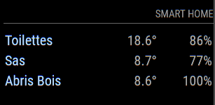

# Magic Mirror Module Hue Sensors []

The `hue-sensors` module is a <a href="https://github.com/MichMich/MagicMirror">MagicMirror</a> addon.
This module displays your Philips Hue motion sensors' temperature and battery life in a table.



## How to use this module

-   Clone this repo in `~/MagicMirror/modules` with the following command: `cd ~/MagicMirror/modules && git clone https://github.com/Rivelia/MMM-hue-sensors`
-   Update your [Magic Mirror Config](https://github.com/MichMich/MagicMirror/blob/master/config/config.js.sample), by adding the following object:
    To use this module, add it to the modules array in the `config/config.js` file:

```javascript
modules: [
	{
		module: 'MMM-hue-sensors',
		position: 'top_right',
		header: 'Smart Home',
		config: {
			bridgeApiUrl: 'http://YOUR_HUE_BRIDGE_IP/api',
			userId: 'YOUR_USER_ID',
			updateInterval: 60000,
			animationSpeed: 0,
		},
	},
];
```

## Config

-   `module` the name of the module you are installing.
-   `position` where you want the MMM-hue-sensors module to appear.
-   `bridgeApiUrl` the URL to the API endpoint of your Philips Hue Bridge. It is recommended you use a static IP to the bridge, or a local DNS pointing to it.
-   `userId` follow [these steps](https://developers.meethue.com/develop/get-started-2/) and copy paste the obtained "username" key value.
-   `updateInterval` default is set to 1 minute (in milliseconds)
-   `animationSpeed` the fade animation speed in milliseconds. Use 0 for no animation.

## Contributing

Pull requests and stars are always welcome. For bugs and feature requests, [please create an issue](https://github.com/Rivelia/MMM-hue-sensors/issues)

## Author

**Baptiste Michel**

-   [GitHub](https://www.github.com/rivelia)
